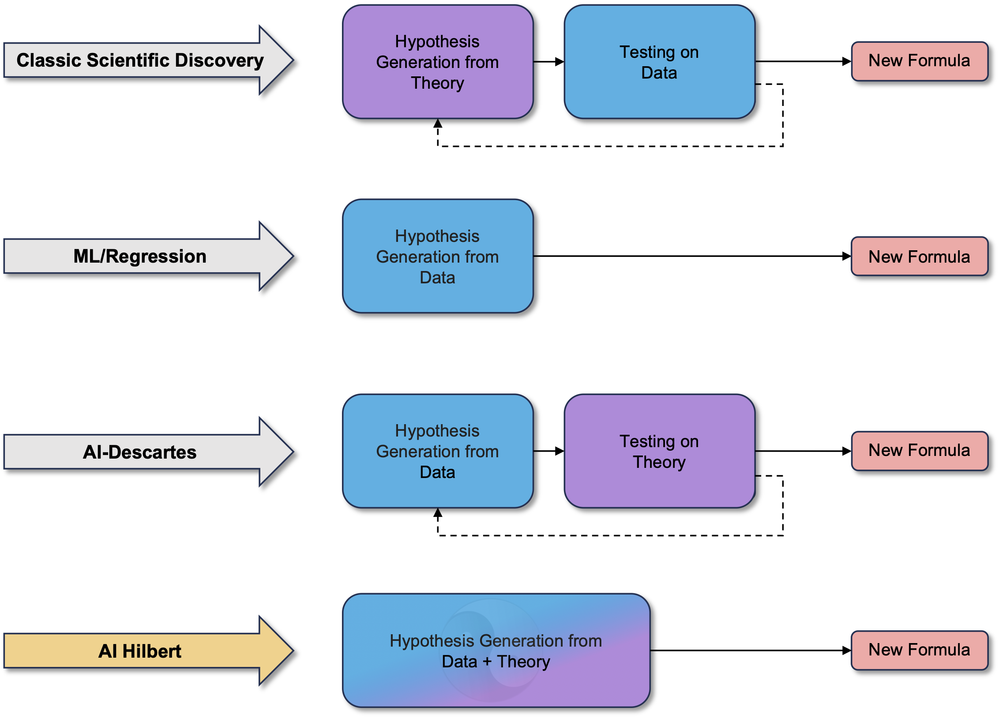
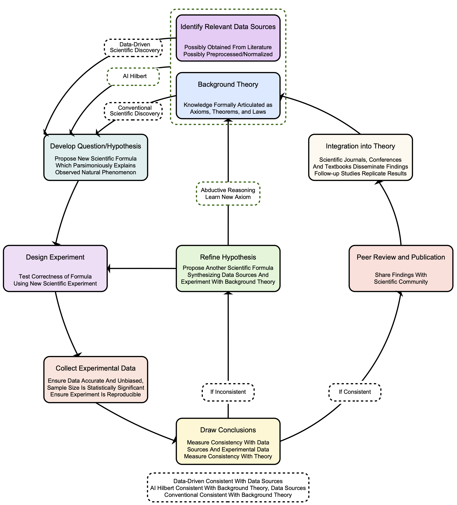
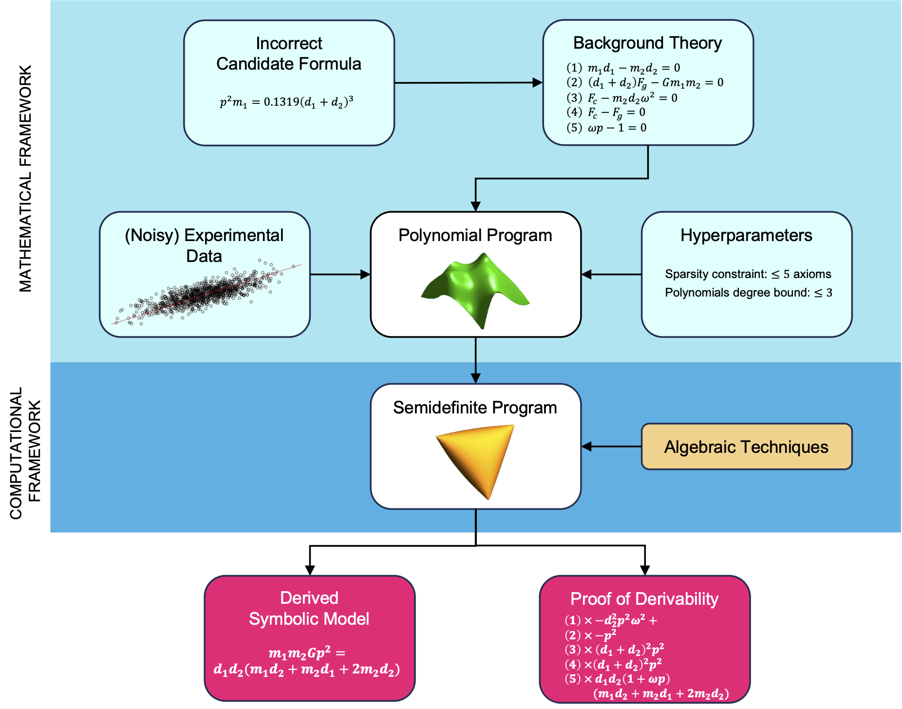
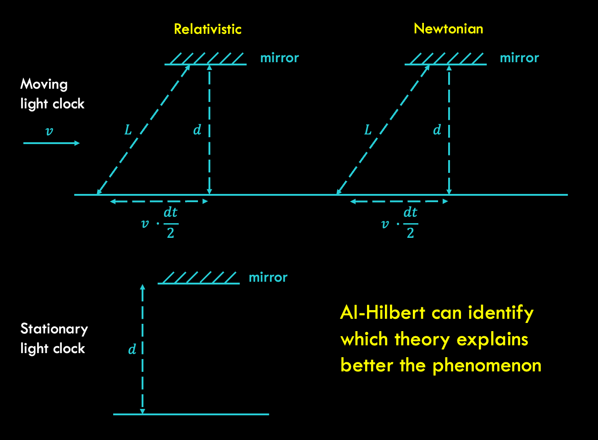
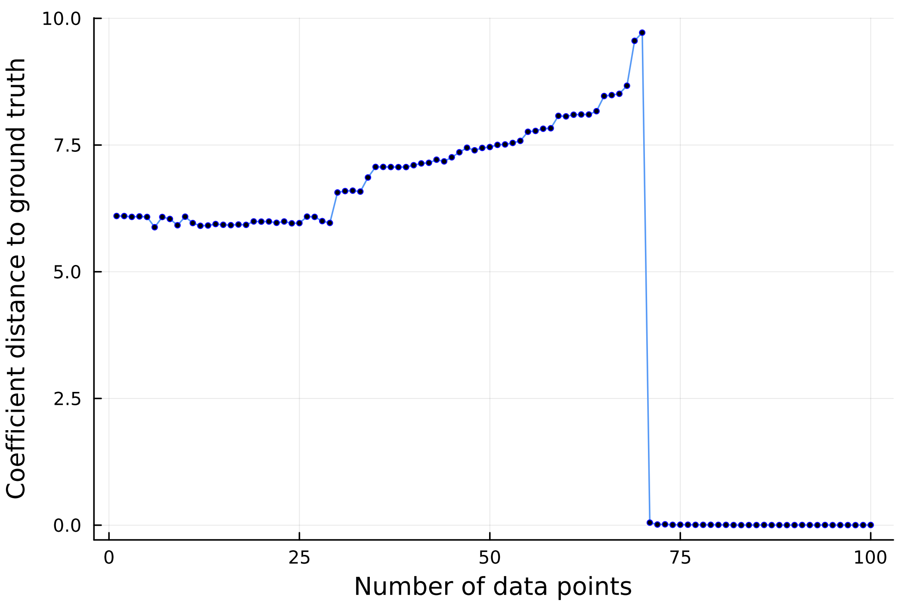
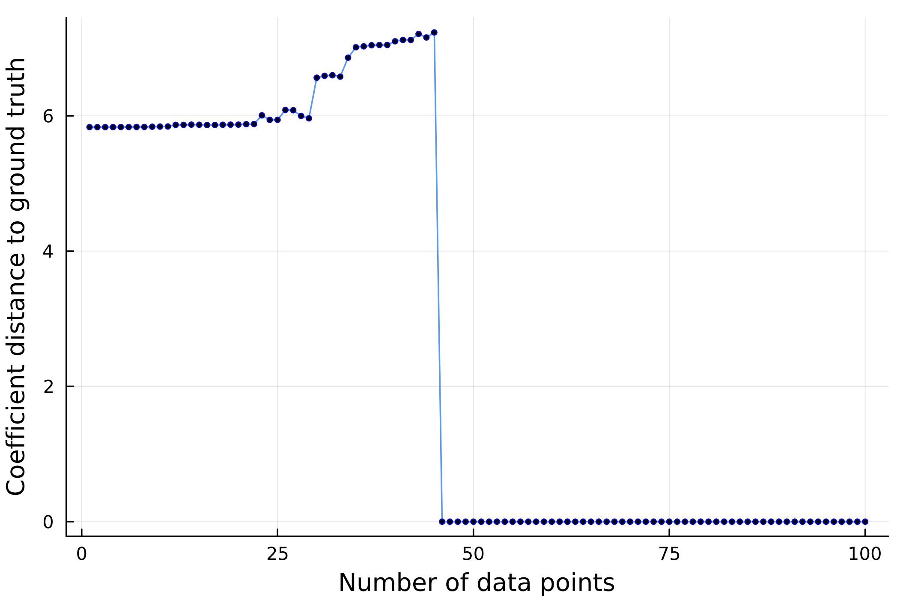

 <a href="https://ai-hilbert.github.io/authors"> About the authors 👤 👤 👤 </a>

 <a href="https://ai-hilbert.github.io/references"> References and Videos 📖 📚 🎦 </a>

 <a href="https://github.com/IBM/AI-Hilbert"> Code and Data   </a>

 

## AI-Hilbert overview

A fundamental challenge in science is explaining natural phenomena in a manner consistent with both noisy experimental data and background knowledge about the universe's laws. 
While the Scientific Method has historically driven significant progress, the rate of new discoveries and their economic contributions have stagnated despite increased investment. Figures like Dirac have noted the increasing difficulty of making groundbreaking discoveries. This stagnation suggests that the "low-hanging fruit" of science—simple laws involving low-degree polynomials—has largely been picked, necessitating more sophisticated approaches. 
Simultaneously, advances in global optimization methods have made it possible to explore the space of scientific laws more efficiently. 
Leveraging these advances, we propose AI-Hilbert, a new approach that integrates background knowledge and experimental data to derive consistent scientific laws articulated as polynomial equalities and inequalities. 
Unlike existing methods that may produce inconsistent or spurious results, AI-Hilbert ensures formal provability and consistency with both theory and data.

The scientific discovery community has traditionally relied on classical methods or data-driven techniques for making discoveries. Our proposed AI-Hilbert system introduces a novel approach by proposing scientific laws that are consistent with a background theory, formally expressed through polynomial equalities and inequalities. This integration allows AI-Hilbert to make scientific discoveries with fewer data points compared to state-of-the-art methods. In contrast, existing approaches often yield laws that may be inconsistent with either the background theory or the data. To illustrate the difference we presents a stylized version of the scientific method, showing how new laws are proposed from background theory and experimental data using classical techniques, data-driven methods, or AI-Hilbert. While data-driven discoveries might conflict with background theory, and classical methods may overlook relevant data, AI-Hilbert ensures consistency with both. 

### The Method

Our method, AI-Hilbert, seeks to discover an unknown polynomial formula that describes a physical phenomenon while aligning with both a background theory of polynomial equalities and inequalities (B) and a set of experimental data (D). 
This method involves a multi-step algorithm, where the inputs include B, D, constraints and bounds (C) dependent on hyperparameters (Λ), and a distance function (dc) defining the distance from a polynomial to the background theory. 
Initially, AI-Hilbert formulates a polynomial optimization problem targeting a specific concept identified by a dependent variable, integrating the background theory, data, and constraints. 
It then reformulates this problem into a semidefinite optimization problem, solving it using a mixed-integer conic optimization solver. 
The output is a candidate formula representing the phenomenon, excluding unobserved variables and accompanied by multipliers providing certificates of its derivability from the background theory. 
This approach ensures that the derived formula is consistent with both the observed data and the underlying scientific principles encapsulated in the background theory.

### When the theory is enough
AI-Hilbert has the capability to derive valid scientific laws just from a complete and consistent background theory. An example is the derivation of the radiated gravitational wave power equation. 
This equation, describes the average power of gravitational waves emitted by two-point masses in Keplerian orbit. 
The special case where m1 = m2 = c = G = 1 is shown in the animation below.
By combining background axioms with appropriate multipliers, AI-Hilbert axiomatically derives this law, overcoming the challenge posed by its complexity. 
Specifically, the Positivstellensatz method employed by AI-Hilbert reveals that the equation emerges from the intersection of points satisfying Kepler’s Third Law and a linearized equation from general relativity. 

### Using the data to refine the theory

AI-Hilbert has the capability to derive valid scientific laws even from an inconsistent yet complete background theory, as illustrated by its ability to discern the correct axiom using measurement data. For instance, in the derivation of Einstein’s relativistic time dilation formula, AI-Hilbert incorporates an inconsistent “Newtonian” axiom proposing light behaves like a mechanical object, alongside a complete set of background axioms. By leveraging experimental data on the relationship between the velocity of a light clock and the passage of time, AI-Hilbert successfully distinguishes between the valid and invalid axioms. The resulting axiomatically derived law precisely matches Einstein’s relativistic time dilation equation, confirming its correctness. This showcases AI-Hilbert’s effectiveness in reconciling conflicting axioms and validating scientific laws.

### Using the data to compensate incomplete knowledge

AI-Hilbert demonstrates its efficacy in deriving valid scientific laws even from an incomplete yet consistent background theory and experimental data. 
By revisiting the derivation of Kepler’s third law of planetary motion and suppressing a subset of axioms, AI-Hilbert verifies its capability to recover the law accurately with varying amounts of noiseless data. 
Notably, as depicted in the figures below, there exists an all-or-nothing phase transition in AI-Hilbert's ability to recover the scientific law, with a threshold number of data points distinguishing between successful recovery and failure. The analysis reveals that when only a single axiom is omitted, scientific discovery can be achieved with as few as 46 data points, whereas more data points are needed when all axioms are missing. This demonstrates the interplay between the value of data and background theory in the scientific discovery process.

&emsp;&emsp;

### Conclusions and Limitations

This work introduces a novel approach to scientific discovery, AI-Hilbert, which integrates concepts from real algebraic geometry and mixed-integer optimization to uncover new scientific laws from potentially incomplete or inconsistent sets of scientific axioms and noisy experimental data. 
Unlike existing methods that rely solely on background theory or data, our approach combines both, enabling discoveries even in data-sparse or theory-limited scenarios. 
We envision AI-Hilbert as a valuable tool for efficiently and accurately explaining natural phenomena, thus aiding scientific progress. 
Looking ahead, we outline promising research directions for extending AI-Hilbert's generality to encompass non-polynomial settings, automating hyperparameter optimization, and enhancing scalability through advanced optimization techniques, presolving methods, and alternative approaches to semidefinite programming.

